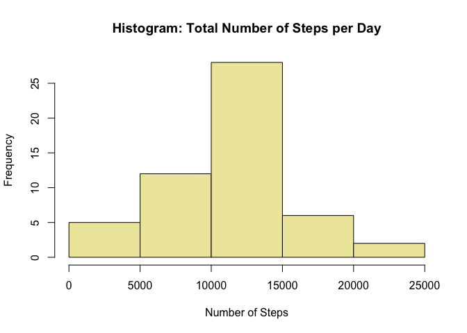
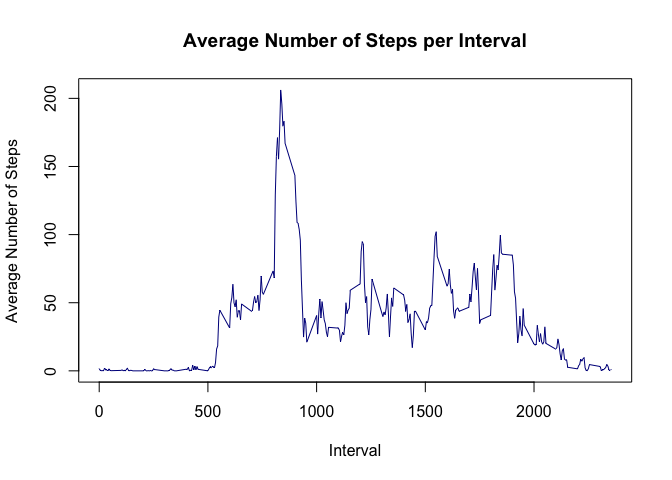
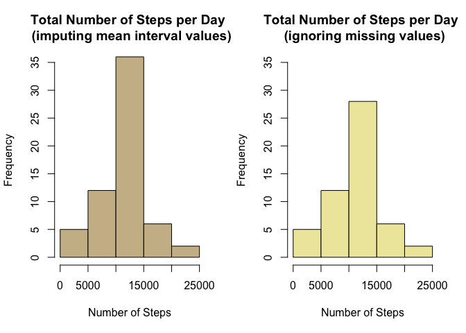
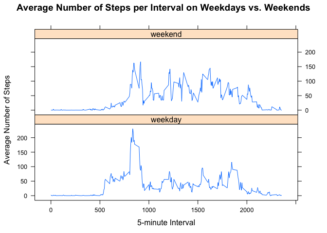

# Reproducible Research: Peer Assessment 1


### Loading and preprocessing the data

#### *Download data set from the course website*

```r
fileUrl <- "https://d396qusza40orc.cloudfront.net/repdata%2Fdata%2Factivity.zip"  
download.file(fileUrl, destfile = "./activity.zip", method = "curl")  
dateDownloaded <- date()  
unzip("./activity.zip", exdir = "./")
```

#### *Load data set*

```r
data <- read.csv("./activity.csv")
```


### What is mean total number of steps taken per day?

#### *1. Make a histogram of the total number of steps taken each day*

```r
# Calculate total number of steps taken each day
dailySteps <- aggregate(steps ~ date, data = data, FUN = sum, na.rm = TRUE)
# Plot histogram of total number of steps taken each day
hist(dailySteps$steps, main = "Histogram: Total Number of Steps per Day", 
     xlab = "Number of Steps", col = "palegoldenrod")
```

 

#### *2. Calculate and report the mean and median total number of steps taken per day*  
**Mean**

```r
mean(dailySteps$steps, na.rm = TRUE)
```

```
## [1] 10766
```
**Median**

```r
## Median total number of steps per day
median(dailySteps$steps, na.rm = TRUE)
```

```
## [1] 10765
```
**Conclusion**: The **mean** total number of steps per day is **10766** steps; and the **median** total number of steps per day is **10765** steps.  
  

### What is the average daily activity pattern?

#### *1. Make a time series plot (type = "l") of the 5-minute interval (x-axis) and the average number of steps taken, averaged across all days (y-axis)*


```r
# First calculate the average number of steps taken
averageSteps <- aggregate(steps ~ interval, data = data, FUN = mean, na.rm = TRUE)
# Then plot the time series
plot(averageSteps, type = "l", col = "darkblue", 
     main = "Average Number of Steps per Interval", 
     xlab = "Interval", ylab = "Average Number of Steps") 
```

 

#### *2. Which 5-minute interval, on average across all days, contains the maximum number of steps?*

```r
averageSteps$interval[which.max(averageSteps$steps)]
```

```
## [1] 835
```
**Conclusion**: The 5-minute interval that contains the maximum number of steps, on average across all days, is interval **835**.


### Imputing missing values

#### *Note that there are a number of days/intervals where there are missing values (coded as NA). The presence of missing days may introduce bias into some calculations or summaries of the data.*  

#### *1. Calculate and report the total number of missing values in the data set (i.e. the total number of rows with NAs)*  

```r
sum(is.na(data))
```

```
## [1] 2304
```
**Conclusion**: There are **2304** rows with missing values (NAs) in the data set.

#### *2. Devise a strategy for filling in all of the missing values in the dataset. The strategy need not be sophisticated. For example, use the mean/median for that day, or the mean for that 5-minute interval.*  
**Strategy**: For each missing value, impute the mean for the 5-minute interval, which has been calculated above in averageSteps

#### *3. Create a new dataset equal to the original dataset but with the missing data filled in*  
First, merge the mean values for each entry as an additional column and rename columns with meaningful names

```r
mergedData <- merge(data, averageSteps, by = "interval")
names(mergedData)[2] <- "steps"
names(mergedData)[4] <- "meanSteps"
```
Then, subset to find entries that are NA and set the steps to meanSteps value

```r
imputedData <- mergedData
imputedData$steps[is.na(imputedData$steps)] <- 
    imputedData$meanSteps[is.na(imputedData$steps)]
```
Finally, confirm that there are no rows with missing data

```r
sum(is.na(imputedData))
```

```
## [1] 0
```


#### *4a. Make a histogram of the total number of steps per day.*  
Note: For comparison, the histogram with imputed values is displayed side-by-side the earlier histogram with NA values.  

```r
# First, using imputed data set, calculate the average number of steps taken
imputedSteps <- aggregate(steps ~ date, imputedData, FUN = sum)
dailySteps <- aggregate(steps ~ date, data, FUN = sum, na.rm = TRUE)
# Then plot the imputed data histogram side-by-side the missing value histogram 
par(mfrow=c(1, 2))
hist(imputedSteps$steps, ylim = c(0, 35), 
     main = "Total Number of Steps per Day \n (imputing mean interval values)", 
     col = "wheat3", xlab = "Number of Steps")
hist(dailySteps$steps, ylim = c(0, 35), 
     main = "Total Number of Steps per Day \n (ignoring missing values)", 
     xlab = "Number of Steps", col = "palegoldenrod")
```

 

```r
par(mfrow=c(1, 1))
```
#### *4b. Calculate and report the mean and median total number of steps per day. Do these values differ from the estimates in first part of assignment? What is the impact of imputing missing data on the estimates of the total daily number of steps?*  
**Mean**

```r
mean(imputedSteps$steps)
```

```
## [1] 10766
```
**Median**

```r
median(imputedSteps$steps)
```

```
## [1] 10766
```
**Conclusion**: Using imputed data, the **mean** total number of steps per day is **10766** (same as original data); while the **median** total number of steps per day is **10766** (one point higher). As seen in the plot above, the modal peak of the 2nd histogram (with imputed mean values) is slightly higher than the 1st histogram (which ignored the missing values). Overall, however, the effect of imputing missing data appears to be small.  


### Are there differences in activity patterns between weekdays and weekends?

#### *1. Create a new factor variable in the dataset with two levels - “weekday” and “weekend” - indicating whether a given date is a weekday or weekend day.*

```r
imputedData$dayType <- as.factor(ifelse(weekdays(as.Date(imputedData$date)) 
            %in%  c("Saturday", "Sunday"), "weekend", "weekday"))
```

#### *2. Make a panel plot containing a time series plot (type = "l") of the 5-minute interval (x-axis) and the average number of steps taken, averaged across all weekday days or weekend days (y-axis).*

```r
# First calculate the average number of steps taken on weekends vs. weekdays
weekdayWeekend <- aggregate(steps ~ interval + dayType, data = imputedData, FUN = mean)
#Then plot the weekend vs. weekday time series
library(lattice)
xyplot(steps ~ interval | dayType, weekdayWeekend, type = "l", layout = c(1, 2), 
       xlab = "5-minute Interval", 
       ylab = "Average Number of Steps", 
       main = "Average Number of Steps per Interval on Weekdays vs. Weekends")
```

 


